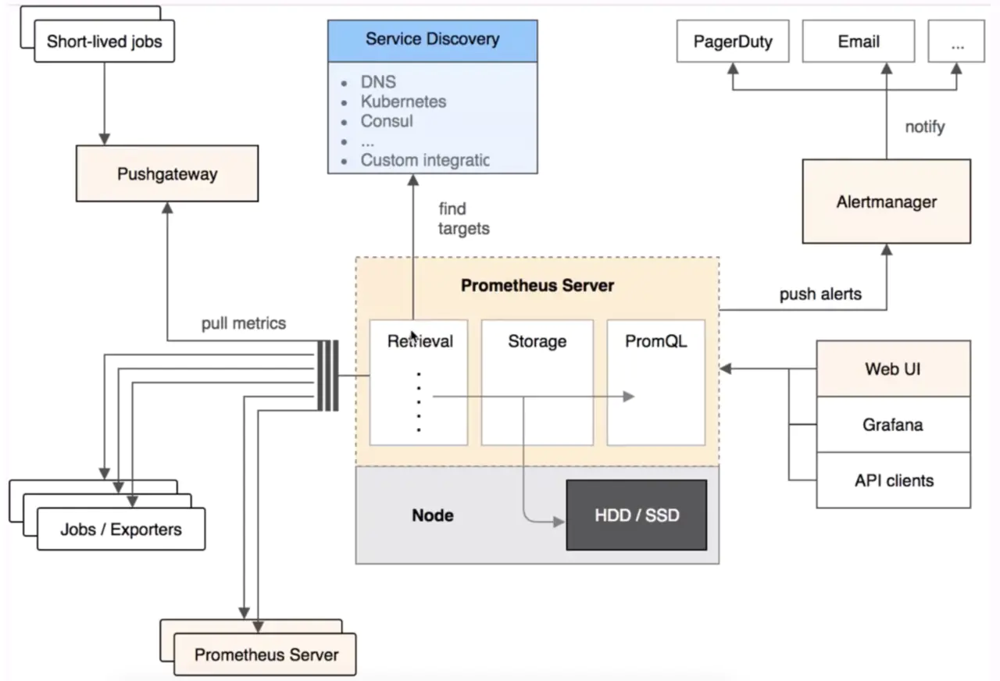

#### prometheus+grafana监控flink框架搭建(简)

##### 1. 概念

+ prometheus：开源监控系统，Prometheus 从根本上存储的所有数据都是时间序列数据（Time Serie Data，简称时序数据）。时序数据是具有时间戳的数据流，该数据流属于某个度量指标（Metric）和该度量指标下的多个标签（Label）。除了提供存储功能，Prometheus 还可以利用查询表达式来执行非常灵活和复杂的查询。但只能解析固定格式的metric数据，pushgateway与node_exporter生成的metric满足条件。
+ grafana：主流可视化工具，可接入多种数据源

#### 2.prometheus架构图



+ node_exporter

  + 用于机器系统数据收集 ，cpu、内存等

+ pushgateway

  + 用于获取外部数据，flink已整合

+ alertmanager

  + 用于告警

+ grafana

  + 可视化监控指标

  

#### 3.安装（Ubuntu）

1. prometheus

   ````linux
   cd /prometheus(安装目录) && wget https://github.com/prometheus/prometheus/releases/download/v2.12.0/prometheus-2.12.0.linux-amd64.tar.gz 
   tar -zxf prometheus-2.12.0.linux-amd64.tar.gz
   mv prometheus-2.12.0.linux-amd64 prometheus
   chown root.root prometheus -R
   
   # 配置为服务centos为/usr/lib/systemd/system/prometheus.service
   cat >/etc/systemd/system/prometheus.service <<EOF	# linux shell 的here document 用法
   [Unit]
   Description=Prometheus
   Documentation=https://prometheus.io/
   After=network.target
   
   [Service]
   Type=simple
   # 命令、配置文件目录
   ExecStart=/prometheus/prometheus/prometheus --config.file=/prometheus/prometheus/prometheus.yml
   Restart=on-failure
   
   [Install]
   WantedBy=multi-user.target
   EOF
   
   # 安装pushgateway后接入其数据（格式严格），node_exporter一样
   vim prometheus.yml
   - job_name: 'pushgateway'	
       honor_labels: true		# 避免收集数据本身的 job 和 instance 被覆盖
       static_configs:
       - targets: ['192.168.0.123:9091']	# pushgateway地址，默认为http，默认后面的目录为\matric，所以可省略
         labels:
             instance: pushgateway	# 与job_name共同决定一个metric来源，即实例
   
   # 设置服务开机自启动
   systemctl enable prometheus
   systemctl start prometheus
   
   # 直接启动
   nohup ./prometheus --config.file=prometheus.yml 2>&1 1>prometheus.log &
   
   # 查看服务
   [root@bigdata01 pushgateway]# netstat -lntup |grep prometheus
   tcp6       0      0 :::9090                 :::*                    LISTEN      16655/prometheus
   ````

   + UI页：9090
     

2. node_exporter：端口9100

   ````linux
   cd /prometheus && wget -c https://github.com/prometheus/node_exporter/releases/download/v0.18.1/node_exporter-0.18.1.linux-amd64.tar.gz
   tar zxf node_exporter-0.18.1.linux-amd64.tar.gz
   mv node_exporter-0.18.1.linux-amd64 node_exporter
   chown root.root node_exporter -R
   
   # 配置服务
   cat >/etc/systemd/system/node_exporter.service <<EOF
   [Unit]
   Description=node_exporter
   Documentation=https://prometheus.io/
   After=network.target
   
   [Service]
   Type=simple
   ExecStart=/prometheus/node_exporter/node_exporter
   Restart=on-failure
   
   [Install]
   WantedBy=multi-user.target
   EOF
   
   # 设置服务开机自启动
   systemctl stop node_exporter.service
   systemctl enable node_exporter.service
   systemctl restart node_exporter.service
   # 运行状态
   systemctl status node_exporter.service
   
   
   # 查看服务
   [root@bigdata01 pushgateway]# netstat -lntup |grep node_export
   tcp6       0      0 :::9100                 :::*                    LISTEN      4551/node_exporter
   ````

   

3. alertmanager

   ````linux
   cd /prometheus && wget -c https://github.com/prometheus/alertmanager/releases/download/v0.18.0/alertmanager-0.18.0.linux-amd64.tar.gz
   tar zxf alertmanager-0.18.0.linux-amd64.tar.gz
   mv alertmanager-0.18.0.linux-amd64 alertmanager
   chown root.root alertmanager -R
   
   # 配置服务
   cat >/usr/lib/systemd/system/alertmanager.service <<EOF
   [Unit]
   Description=Alertmanager
   Documentation=https://prometheus.io/
   After=network.target
   
   [Service]
   Type=simple
   ExecStart=/prometheus/alertmanager/alertmanager --config.file=/prometheus/alertmanager/alertmanager.yml
   Restart=on-failure
   
   [Install]
   WantedBy=multi-user.target
   EOF
   
   # 设置服务开机自启动
   systemctl enable alertmanager
   systemctl start alertmanager
   
   # 直接启动
   nohup ./alertmanager --config.file=alertmanager.yml 2>&1 1>alertmanager.log &
   
   # 查看服务
   [root@bigdata01 pushgateway]# netstat -lntup |grep alertmanager
   tcp6       0      0 :::9094                 :::*                    LISTEN      17237/alertmanager
   tcp6       0      0 :::9093                 :::*                    LISTEN      17237/alertmanager
   udp6       0      0 :::9094                 :::*                                17237/alertmanager
   ````

   

4. pushgateway：端口9091

   ````linux
   cd /prometheus && wget -c https://github.com/prometheus/pushgateway/releases/download/v0.9.1/pushgateway-0.9.1.linux-amd64.tar.gz
   tar zxf pushgateway-0.9.1.linux-amd64.tar.gz
   mv pushgateway-0.9.1.linux-amd64 pushgateway
   chown root.root pushgateway -R
   
   # 配置服务
   cat >/etc/systemd/system/pushgateway.service <<EOF
   [Unit]
   Description=pushgateway
   Documentation=https://prometheus.io/
   After=network.target
   
   [Service]
   Type=simple
   ExecStart=/prometheus/pushgateway/pushgateway
   Restart=on-failure
   
   [Install]
   WantedBy=multi-user.target
   EOF
   
   # 设置服务开机自启动
   systemctl stop node_exporter.service
   systemctl enable node_exporter.service
   systemctl restart node_exporter.service
   
   # 查看服务
   [root@bigdata01 pushgateway]# netstat -lntup |grep push
   tcp6       0      0 :::9091                 :::*                    LISTEN      5982/pushgateway
   ````

   

5. grafana：<https://grafana.com/grafana/download> 

   ````linux
   wget https://dl.grafana.com/oss/release/grafana-6.3.3-1.x86_64.rpm 
   # contos:sudo yum localinstall grafana-6.3.3-1.x86_64.rpm -y
   # 启用Universe存储库
   sudo add-apt-repository universe
   # 更新包索引并安装外包
   sudo apt updatesudo apt install alien
   # 安装
   sudo alien -i package_name.rpm
   
   systemctl enable grafana-server.service
   systemctl start grafana-server.service
   
   # 安装插件
   grafana-cli plugins install grafana-piechart-panel
   systemctl restart grafana-server
   ````

   + web页面3000 

#### 4.pushgateway整合flink

+ flink opt目录下的  flink-metrics-prometheus-1.9.0.jar 依赖放到 lib目录下

+ 配置flink-conf.yaml

  ````shell
  metrics.reporter.promgateway.class:
  	org.apache.flink.metrics.prometheus.PrometheusPushGatewayReporter
  metrics.reporter.promgateway.host: localhost	# ⽆无默认值，配置 PushGateway 服务所在的机器器 IP
  metrics.reporter.promgateway.port: 9091	# 默认值是 -1，这⾥里里配置 PushGateway 服务的端⼝口
  metrics.reporter.promgateway.jobName: liu	# ⽆无默认值，要上报 Metrics 的 Job 名称
  metrics.reporter.promgateway.randomJobNameSuffix: true	# 默认值是 true，指定是否将随机后缀名附加到作业名
  metrics.reporter.promgateway.deleteOnShutdown: false
  ````

+ 启动流


#### 5.grafana接入prometheus数据

1. 进入grafanaUI页 http://192.168.0.123:3000/?orgId=1，登录信息：admin/admin（sanniuben）
   

   

   

   

   

   


参考资料：

1.<https://flink.sojb.cn/monitoring/metrics.html>

2.<https://juejin.im/post/5d79d804e51d453b7779d5ce#heading-25> 

3.<https://songjiayang.gitbooks.io/prometheus/content/pushgateway/how.html> 